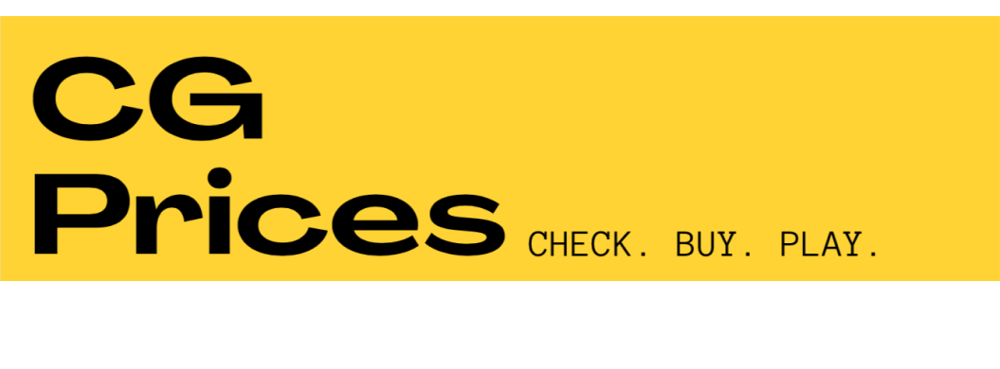

<!-- BADGES -->
[](https://github.com/msHoffmann/infnet-website/blob/main/LICENSE)
[](https://github.com/msHoffmann/)

<br />
    

<div align="center">
  <h3 align="center">CG Prices. Check. Buy. Play.</h3>
  <p align="center">
    É hora do duelo!
<br />
      <p align="center">
    Acesse o site e veja os preços das cartas em real, dólar e euro.
<br /> 
    <a href="https://nervous-yonath-5f59bd.netlify.app/"><strong>Acessar Demonstração »</strong></a>
  </p>
</div>


<details>
  <summary>Sumário</summary>
  <ol>
    <li><a href="#sobre-o-projeto">Projeto</a></li>
    <li>
      <ul>
        <li><a href="#pré-requisitos">Pré-requisitos</a></li>
        <li><a href="#executando-o-site">Executando o Site</a></li>
      </ul>
    </li>
    <li><a href="#tecnologias-utilizadas">Tecnologias</a></li>
    <li><a href="#autor">Autor</a></li>
    <li><a href="#agradecimentos">Agradecimentos</a></li>
    <li><a href="#licença">Licença</a></li>
  </ol>
</details>


# Projeto

Bem-vindo(a) ao meu segundo projeto! 
A maior necessidade de um jogador de Cardgame é saber avaliar o valor da sua carta na hora da compra, venda e troca! Sua negociação a partir de agora ficará mais fácil com o site CG Prices. O MVP do site mostra as cinco cartas em alta e cinco cartas em baixo, ou seja, que aumentaram e diminuiram de preço, respectivamente. Clique na carta, veja os preços dos sites mais conhecidos do mercado: Liga Yugioh, TCG Player e Card Market e guarde nos seus Favoritos.

Os recursos implementados foram:

    Layout Responsivo - se adequa em diferentes tamanhos de tela;
    Listagem Dinâmica - cartas agrupadas por grupos;
    Favoritos - adição e remoção das cartas escolhidas;
    Contato - tela para conhecer a programadora;


A demonstração do site funcionando está disponível no link: https://nervous-yonath-5f59bd.netlify.app/


## Pré-requisitos

Antes de seguir o passo a passo para executar o projeto é preciso ter instalado no computador o [Git](https://git-scm.com/) e um servidor HTTP local (recomendo a utilização da extensão [Live Server](https://marketplace.visualstudio.com/items?itemName=ritwickdey.LiveServer) do [Visual Studio Code](https://code.visualstudio.com/)).

## Executando o site

- Faça o download do código fonte no computador:
```sh
git clone https://github.com/msHoffmann/infnet-cgPrices.git
```

- Abra o projeto no VS Code e execute a extensão Live Server ou coloque os arquivos no servidor HTTP desejado.


# Tecnologias
- HTML5
- CSS
- Javascript Vanilla
- Bootstrap


# Autor
Frania Lopes Hoffmann - franiahoffmann@gmail.com

https://www.linkedin.com/in/frania-lopes-hoffmann/


# Agradecimentos

Agradeço ao [Infnet](https://www.infnet.edu.br/) e Professor Victor de Assis Campos Oliveira (https://www.linkedin.com/in/victorassis/) peloss primeiros passos e excelentes aulas no mundo da Programação.


# Licença

Este projeto esta sobe a licença MIT. Veja [LICENSE](https://github.com/msHoffmann/infnet-cgPrices/blob/main/LICENSE) para mais informações.